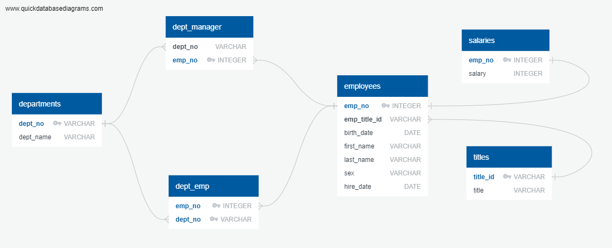

# SQL_Challenge

This task included researching employees from a corporation from the 1980s and 1990s within 6 CSV files. The following was completed: 

* Data Modeling: 
    - An ERD was created 
    - Tables were designed to hold and organize the data - including primary and foreign keys
    - The data was then imported into a SQL database for further analysis
    
     
    
* Data Analysis
    - Queries were written to demonstrate the following: 
        -  List the following details of each employee: employee number, last name, first name, sex, and salary.
        -  List first name, last name, and hire date for employees who were hired in 1986.
        -  List the manager of each department with the following information: department number, department name, the manager's employee number, last name, first name.
        -  List the department of each employee with the following information: employee number, last name, first name, and department name.
        -  List first name, last name, and sex for employees whose first name is "Hercules" and last names begin with "B."
        -  List all employees in the Sales department, including their employee number, last name, first name, and department name.
        -  List all employees in the Sales and Development departments, including their employee number, last name, first name, and department name.
        -  In descending order, list the frequency count of employee last names, i.e., how many employees share each last name.

    - The SQL database was imported into Pandas
    - A histogram was created to visualize the most common salary ranges for employees 
    - A bar chart was created to visualize average salary by title

Copyright
Trilogy Education Services © 2019. All Rights Reserved.